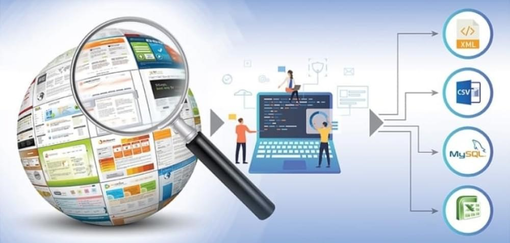
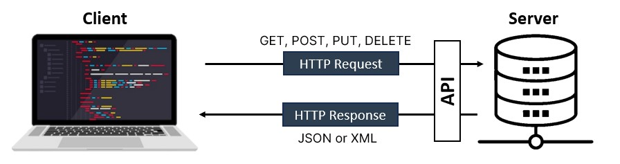
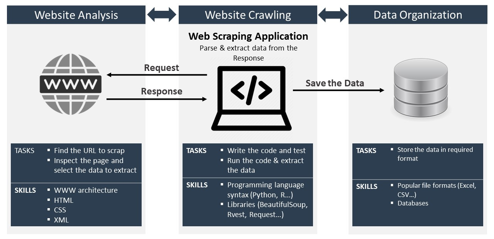

```{=html}

<style>
  
  h1.title{margin-bottom: 3px}
  
  h3.subtitle { margin-top: 0px; 
                margin-bottom: 30px;
                color: black; }
  
  body {text-align: justify;
        color: black;
        background-color: white;
        line-height: 1.5; }
        
  .my_body { line-height: 1.5; }
  
  a{color:blue}
  
        
</style>
```
<h5 style = "color:grey">

<b>Author:</b> João Neto\
<b>LinkedIn:</b> linkedin.com/in/joaonetoprofile

<h5>



<hr>

::: my_body
To better understand Web data extraction techniques, this literature review is based on scientific papers and books about the theme for a higher awareness of steps and decisions to take under good practice.

<b>Keywords:</b> Web scraping, Web crawling, APIs, REST APIs, Robots.txt, sitemaps, Regex, HTML DOM, Legal & Ethics, Python, BeautifulSoup

# Introduction: Extract data from web pages

Webpages are built and designed for human consumption and not for ease and automated data collection (Glez-Peña et al., 2013). For that reason, the data on the websites are unstructured, which implies using tools/methods/techniques to convert them into a structured form (Eswari et. al., 2022). According to Dongo et. al. (2021), three well-known methods have been applied to extract/collect data from web pages:

-   Web scraping
-   APIs (Application Programming Interface)
-   Manual extraction / copy-past method

Web scraping and APIs are automated techniques and the most practical ways to collect data from various website pages and repositories (Dongo et. al. 2021). High speed, accuracy, less labour-intensive and less human errors are advantages of automated techniques compared with manual extraction (Bradley & James, 2019, Dongo et. al. 2021, Eswari et. al., 2022).

An API is an interface that allows communication between software, independent of the website structure or content. APIs provide a robust structure to download and interconnect large sets of heterogeneous information (Glez-Peña et al., 2013). Web scraping is gathering data through any means other than a program interacting with an API (Mitchell, 2018). In practice, and due to the different structures of each website (Eswari et. al., 2022), web scraping requires writing software for each one, encompassing a wide range of programming techniques and technologies (Glez-Peña et al., 2013, Mitchell, 2018).

Therefore, before scraping a website, it is a good idea to check if it offers an API that allows users to quickly collect data directly from the database behind the website (Bradley & James, 2019). However, whether API does not exist or has limitations, Web scraping to gather the data is needed (Dongo et. al., 2021).

# Web scraping or APIs

In an ideal world, web scraping wouldn't be necessary, and each website would provide an API (Jarmul & Lawson, 2017) to share their data in a structured format (Dongo et. al., 2021). APIs are designed to provide a convenient stream of well-formatted data from one computer program to another (Mitchell, 2018), but although some websites do provide APIs, they typically restrict the data that is available and the frequency it can be accessed (Jarmul & Lawson, 2017, Dongo et. al., 2021). Additionally, website developers might change, remove, or restrict the backend API (Jarmul & Lawson, 2017).<br> <br> On the opposite of web scraping, which is affected by webpage changes, APIs are independent of the information displayed on the website (Dongo et. al., 2021), turning APIs fantastic if you find one that suits your purposes (Mitchell, 2018). Web scraping is more flexible than API extraction once it is not restricted to the information that APIs offer (Dongo et. al., 2021).<br> <br> Regarding cost and rate limit, extracting data using API is not free and has a limit (Dongo et. al., 2021) while with web scraping the costs linked are to the application development to parse and extract the data (Hillen, 2019). Although web scraping does not have a defined rate limit, it makes the website traffic spike and may cause the breakdown of the website server (Eswari et. al., 2022), so is a good practice to make download requests at a reasonable rate (Jarmul & Lawson, 2017) to spread out the traffic to the website.<br> <br> In general, it is preferable to use an API (if one exists), rather than build a bot to get the same data. However, according to Mitchell (2018) an API might not exist or be useful for your purposes, for several reasons: - You are gathering relatively small, finite sets of data across a large collection of websites without a cohesive API. - The data you want is fairly small or uncommon, and the creator did not think it warranted an API. - The source does not have the infrastructure or technical ability to create an API. - The data is valuable and/or protected and not intended to be spread widely. <br><br> Even when an API does exist, the request volume and rate limits, the types of data, or the format of data that it provides might be insufficient for your purposes, this is where web scraping steps in.

```{r warning=FALSE, echo=FALSE, message=FALSE}

library(tidyverse)
library(knitr)
library(kableExtra)

table <- data.frame(
  characteristic = c("Affected by website changes", "Costs", "Limit rate"),
  Web_Scraping = c("Yes", "Free", "No"),
  API = c("No", "Not free", "Yes")
)

kable(
  x = table,
  col.names = c("", "Web Scraping", "APIs"),
  align = c("l", "c", "c")
  ) %>% 
  kable_styling(
    full_width = FALSE,
    position = "center",
    bootstrap_options = c("striped", "responsive")) %>% 
  add_footnote(
    label = c("Table 1 - Difference between Web Scraping and APIs (Own creation)"), 
    escape = FALSE,
    notation = "none") %>% 
  row_spec(0, background = "#2C3E50", color = "white") %>% 
  row_spec(1:3, extra_css = "border-bottom: 1px solid grey" )

```

# APIs

The keyword interface is what better describes what an API is, an interface that a software program presents to other programs (Jin et. al., 2018). In other words, an API provides a common ground for one piece of software to talk to another piece of software running on another machine (Anuff, 2017). APIs are building blocks that allow the communication and interaction between systems for major business platforms on the web (Jin et. al., 2018) once they facilitate the interaction between those different software programs and access to their services (Dongo et. al., 2021).

An API paradigm defines the interface exposing the backend data of a service to other applications (Jin et. al., 2018). Within this context, Request-Response APIs expose an interface through an HTTP-based web server with three common paradigms: REST (Representational State Transfer), RPC, and GraphQL (Jin et. al., 2018). REST is the most popular choice for API development and the one we will explore a bit.

REST APIs are all about resources; they handle data as resources and use standard HTTP methods (GET, POST, PUT, DELETE) to perform operations. In practice, operating through the Request-Response cycle, the client makes HTTP requests to the Server that returns responses, typically in JSON or XML format. Our program is called the client, and the web server is called the server. Another relevant concept is Endpoints, which are specific URLs that the client applications use to access the resources of a web service (*source:* <https://realpython.com/api-integration-in-python/#api-endpoints>[)](https://realpython.com/api-integration-in-python/#api-endpoints), combining a URL and an HTTP method. Commonly, an API has multiple endpoints to manage the resources in the web service (*source:* <https://realpython.com/api-integration-in-python/#api-endpoints>[)](https://realpython.com/api-integration-in-python/#api-endpoints).

Once a REST API receives and processes an HTTP request, it will return an HTTP response that includes a status code, indicating the success or failure of the request. The Standard HTTP response status code is:

-   **2XX** range indicates success.
-   **3XX** codes indicate a resource has moved.
-   **4XX** range indicates a client-side error (like a missing required parameter or too many requests).
-   **5XX** range indicates server-side errors.

# Web scraping

Web scraping, a software agent, also known as a Web robot (Glez-Peña et al., 2013) describes the automated process of accessing websites and downloading specific information (Hillen, 2019, Eswari et. al., 2022), changing unstructured data into a structured form suitable for further analysis and storage (Glez-Peña et. al., 2013). These data can take the form of numbers, text, images, or videos (Bradley & James, 2019).

In practice, web scraping is about writing software which mimics the browsing interaction between the Web servers and the human. Step by step, the script imitates a web user accessing the websites to parse their contents and extract data (Glez-Peña et. al., 2013, Hillen, 2019).

It's important to be aware of legal and ethical considerations when scraping websites, avoid overloading their servers (Aaglave et. al., 2023), and respect the website's terms of use described in its 'robots.txt' file (Glez-Peña et. al., 2013). All these points are forward explored further.

## Pros & Limitations

**Pros**

-   **Low costs:** Good datasets can be expensive. Using web scraping is free for some cases where policies allow it (Dongo et. al. 2021). The costs associated are the time required to write and test the code (Hillen, 2019)

**Limitations:**

-   **No historic data:** Web scraping means collecting real-time data; hence, it is not able to access historical data. To come up with a sufficiently long time series, one needs to start data collection from day zero of the respective period, requiring careful planning ahead (Hillen, 2019).
-   **Network speed:** The network speed may affect when and how the data is displayed (Glez-Peña et al., 2013), and can affect the data extraction when the page is not displayed (Dongo et. al., 2021).
-   **Ongoing maintenance:** Every website has a different structure which involves site-specific programming (Eswari et. al., 2022, Glez-Peña et al., 2013). Due to the website changes, the scripts developed must be updated to the new format or layout of the information (Dongo et. al., 2021, Glez-Peña et al., 2013). Although some code elements are helpful as building blocks, there is always a need to adapt the script, depending on how the website is set up, the page structure, authentication requirements, etc., because many websites use reactive elements, simple HTTP requests cannot be used (Hillen, 2019).

## Legal & Ethics considerations

Web scraping itself is a technology and is not per se illegal or legal, however, legal constraints and ethical concerns can and need to be debated (Hillen, 2019).

How to deal with web scraping is still subject to discussion in the legal literature and the law is still evolving (Hillen, 2019), despite numerous rulings over the past two decades (Jarmul & Lawson, 2017). In any case, when scraping from a website, we are the guests and need to behave politely otherwise, the IP address may be banned or could suffer legal actions (Jarmul & Lawson, 2017). There is no difference between visiting or scraping a website, in both cases, the user is a guest and thus, is not the owner of the data extracted (Glez-Peña et al., 2013).

Only public content should be accessed, and copyright policies must be complied with (Hillen, 2019). Should also be taken measures to review the Terms of Service of the site (Jarmul & Lawson, 2017). A general rule of thumb, any information stored behind a username and password is considered private and ought not to be web-scraped (Bradley & James, 2019). Large websites require user registration often and can detect scrapers (Hillen, 2019).

If the scraped data is being used for personal and private use, and within fair use of copyright laws, there is usually no problem. However, if the data is going to be republished, if the scraping is aggressive enough to take down the site, or if the content is copyrighted and the scraper violates the terms of service, then there are several legal precedents to note (Jarmul & Lawson, 2017).

Jarmul & Lawson (2017) analysed various cases involving companies, having suggested that when the scraped data constitutes public facts (such as business locations and telephone listings), it can be republished following fair use rules. However, if the data is original (such as opinions and reviews or private user data), it most likely cannot be republished for copyright reasons.

In the end, and case of doubts, the best practice is certainly to obtain the explicit permission of the website operator to scrap the data (Hillen, 2019).

## Good practices

Before diving into crawling a website, should be developed an understanding of the scale and structure of the website, for that, robots.txt and sitemaps files can help (Jarmul & Lawson, 2017). Other details could also be important.

-   **Robots.txt:** How do you know which websites are allowed or not to scrape? The answer is through the robots.txt file that most websites provide (Jarmul & Lawson, 2017). The robots.txt file is part of the Robots Exclusion Protocol (REP), a group of web standards that regulate how robots crawl the web, access and index content, and serve that content up to users (source: <https://moz.com/learn/seo/robotstxt>). To access the robots.txt file, it is just simply put robots.txt after the URL to scrape and will be shown which information on the website the host allows to scrape (Eswari et. al., 2022). The restrictions are just a suggestion, but good web citizens will follow them (Jarmul & Lawson, 2017). More information about the robots.txt protocol is available at <http://www.robotstxt.org>.
-   **Sitemaps:** provides links to all the web pages, helping crawlers locate the updated content without needing to crawl every web page. The sitemap standard is defined at <http://www.sitemaps.org/protocol.html>.
-   **Estimate the size of the website**
-   **Identify the technology used by a website**
-   **Finding the owner of a website**

## Technical procedures

When web scraping, it is a good idea to insert pauses between downloading web pages, as this helps spread out the traffic to the website. Web scrapers may be banned from a website if they put undue stress on it (Bradley & James, 2019).

Should make download requests at a reasonable rate (Jarmul & Lawson, 2017). Should be aware that requesting a page multiple times in rapid succession can be seen as suspicious, or even malicious, use of a website (Eswari et. al., 2022).

Define a user agent to identify our crawler (Jarmul & Lawson, 2017). The 'User-Agent' is an important request header, because the server looks into it to find out what kind of program is accessing its contents (browser versus a robot), eventually differentiating user responses (Glez-Peña et. al., 2013).

Reviewing the Terms of Service of the site and ensuring the data taken is not considered private or copyrighted are good practices to consider and avoid legal actions against us (Jarmul & Lawson, 2017).

## Phases of Implementation

There are in the literature mentions of phases for web scraping implementation where each phase requires a different skill set (Krotov & Tennyson, 2021, Dewia et. al., 2019, Eswari et. al., 2022). Although the authors describe different numbers and names of phases, the concept is the same. It can be generically split into 3 phases: firstly, explore the website to check the host permissions and find the target information, write and run the script to collect data from the website (technically called as web crawling), and lastly save/store the data collected. Despite being listed in order are often intertwined and go back and forth between phases until a clean, tidy dataset suitable for further analysis is obtained.

Krotov & Tennyson (2021) in a web scraping tutorial, described three phases of web scraping implementation:

1.  **"Website Analysis"** phase involves examining the underlying structure of a website or a web repository to understand how the needed data is stored at the technical level.
2.  **"Web Crawling"** phase involves developing and running a script that automatically browses (or "crawls") the web and retrieves the data needed for a research project. These crawling applications (or scripts) are often developed using programming languages such as R or Python.
3.  **"Data Organization"** involves pre-processing and organizing data in a way that enables further analysis. To make further analysis of this data easy, the data needs be to be clean and tidy.

Eswari et. al. (2022) and Hillen (2019) instead of phases, schematised a similar procedure by listing a set of tasks. Combining the two procedures, the steps suggested are:

1.  Find the URL to scrape.

2.  Inspect the page and select the data to extract.

3.  Write the code, test, and debug: once the script is successfully written and tested, its execution can be fully automated by defining a schedule to start the download and time intervals. However, the scraper can be a failure due to changes on the website, so can be built alerts to send an e-mail if a script did not run through completely or if the download size is unusually small.

4.  Run the code and extract the data.

5.  Store the data in the required format.

     **Figure 1:** Web Scraping phases (Own creation)
:::

<hr>

# References

Mitchell, R. (2018). Web Scraping with Python: Collecting More Data from the Modern Web. 2ª Ed. North Sebastopol: O'Reilly Media.

Jarmul, K., & Lawson, R. (2017). Python Web Scraping. 2ªEd. Birmingham: Packt Publishing Ltd.

Dongo, I., Cardinale, Y., Aguilera, A. (2021). A qualitative and quantitative comparison between Web scraping and API methods for Twitter credibility analysis. *International Journal of Web Information Systems* 17 (6), 580-606.

Glez-Peña, D., Lourenço, A., López-Fernández, H., Reboiro-Jato, M., Fdez-Riverola, F. (2013). Web scraping technologies in an API world. *Briefings in Bioinformatics* 15 (5), 788-797.

Bradley, A. & James, R.J.E. (2019). Web Scraping with R. *Association for Psychological Science* 2(3), 264-270

Hillen, J. (2019). Web scraping for food price research. *British Food Journal* 121 (12), 3350-3361.

Dewia, L.C., Meiliana, Chandra, A. (2019). *4th International Conference on Computer Science and Computational Intelligence 2019 (ICCSCI)*.

Krotov, V. & Tennyson, M.F. (2021). Web Scraping in the R language: A Tutorial. *Journal of the Midwest Association for Information Systems*, Vol. 2021, Article 5.

Aaglave, K.N., Jadhav, S.S., Khatib, A.F., Khurangale, R.L. (2023). A Survey on the Web Scraping: In the Search Data. *International Journal of Scientific Research in Computer Science, Engineering and Information Technology* 9(10), 191-195.

Jin, B., Sahni, S., Shevat, A. (2018). Designing Web APIs: Building APIs that developers love. 1^st^ Edition. North Sebastopol: O'Reilly Media.
